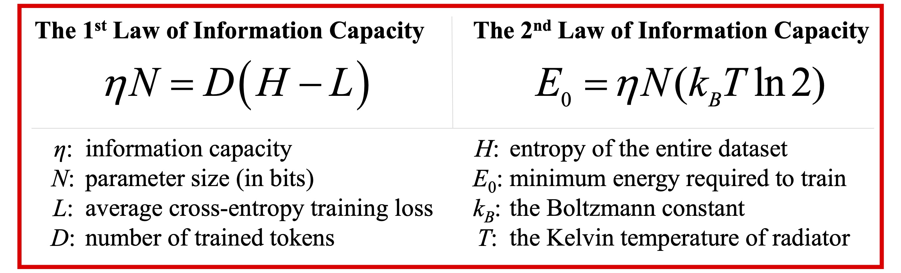

# Physics in Next-token Prediction

[](https://github.com/BestAnHongjun/Physics-in-Next-token-Prediction) [](https://gitee.com/an_hongjun/Physics-in-Next-token-Prediction) [](https://arxiv.org/abs/2411.00660)

Hongjun An<sup>&dagger;</sup>, Yiliang Song<sup>&dagger;</sup>, and Xuelong Li<sup>✉️</sup>

<div align="center"></div>

> <sup>&dagger;</sup>Equal contribution. The authors are with the Institute of Artificial Intelligence (TeleAI), China Telecom, P. R. China. <sup>✉️</sup> Correspondence to: Xuelong Li (xuelong_li@ieee.org).

## Abstract

We discovered the underlying physics in Next-token Prediction (NTP). We identified the law of information conservation within NTP and proposed the **First Law of Information Capacity (IC-1)**, demonstrating that the essence of intelligence emergence in auto-regressive models is fundamentally a process of information transfer. We also introduced Landauer's Principle into NTP, formulating the **Second Law of Information Capacity (IC-2)**, which establishes the relationship between auto-regressive model training and energy consumption. Additionally, we presented several corollaries, which hold practical significance for production practices. Finally, we validated the compatibility and complementarity of our findings with existing theories.

[[ArXiv]](https://arxiv.org/abs/2411.00660) [[YouTube]](https://www.youtube.com/watch?v=hzQLqVZKn7c) [[HuggingFace]](https://huggingface.co/papers/2411.00660)

## Citations

```text
H. An, Y. Song, and X. Li. Physics in Next-token Prediction, 2024.
```

```bibtex
@misc{an2024physicsnexttokenprediction,
    title={{Physics in Next-token Prediction}}, 
    author={Hongjun An and Yiliang Song and Xuelong Li},
    year={2024},
    eprint={2411.00660},
    archivePrefix={arXiv},
    primaryClass={cs.LG},
    url={https://arxiv.org/abs/2411.00660}
}
```